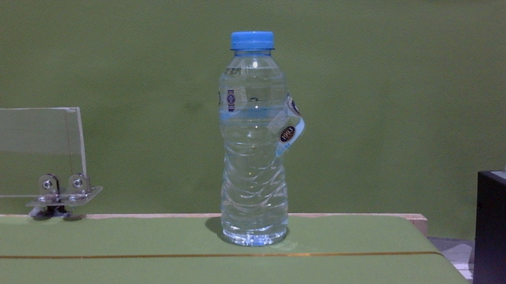
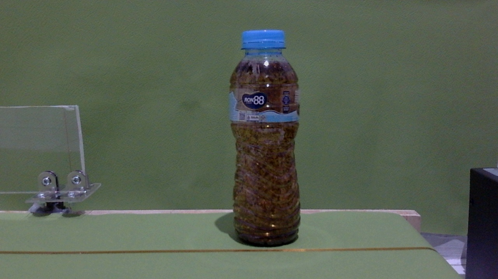
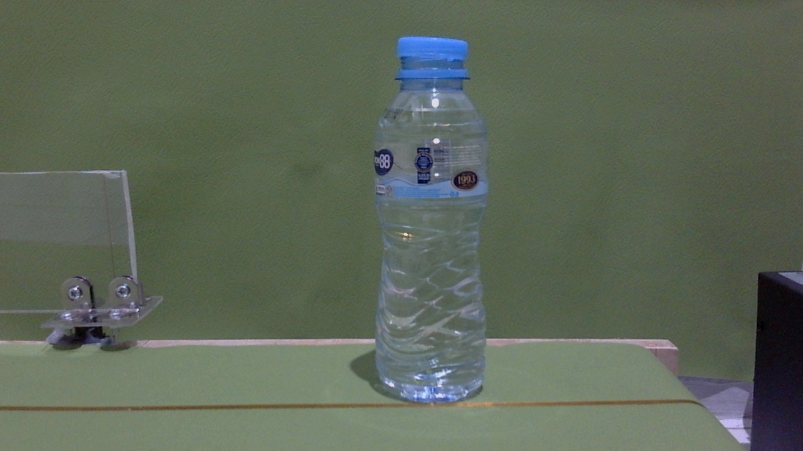
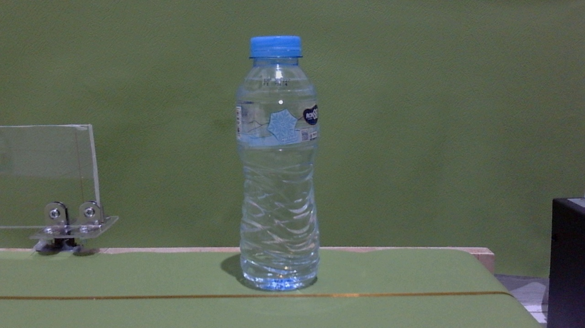

# TWM - Techniki Widzenia Maszynowego - Projekt 26L
## Temat: "Optyczna inspekcja obiektów na taśmociągu"
### Zespół:
* Piotr Walczak 315220
* Katarzyna Wawer 311683
* Bartosz Zaborowski 319996

### ETAP 1 - Założenia wstepne projektu

#### 1. Opis problemu

**Cel projektu:** 
Celem projektu jest stworzenie systemu wizyjnego opartego na metodach klasycznego przetwarzania obrazu, którego zadaniem jest automatyczna inspekcja jakości butelek przemieszczających się na symulowanym taśmociągu. System ma za zadanie w czasie rzeczywistym weryfikować kluczowe parametry dla każdej wykrytej butelki:

1.  **Obecność nakrętki:** Weryfikacja, czy butelka jest fabrycznie zamknięta.
2.  **Poziom napełnienia płynem:** Sprawdzenie, czy ilość płynu w butelce mieści się w akceptowalnej normie.
3. **Stan płynu w butelce:** Czy nie doszło do zanieczyszczenia

**Założenia środowiskowe i techniczne:**
* **Akwizycja obrazu:** Nieruchoma kamera (np. smartfon/kamera internetowa) ustawiona prostopadle do kierunku ruchu butelek.
* **Oświetlenie:** W miarę stabilne i równomierne, minimalizujące ostre odblaski na plastiku/szkle.
* **Tło:** Stałe dla wszystkich zdjęć
* **Obiekty:** Butelki tego samego typu, aby zachować stałą geometrię dla obszarów zainteresowania.

#### 2. Przegląd istniejących rozwiązań (AOI - Automated Optical Inspection)
W przemyśle rozlewniczym i farmaceutycznym problem ten rozwiązywany jest na dwa główne sposoby:

* **Klasyczne systemy wizyjne (Smart Cameras / Algorytmy deterministyczne):**
    * *Mocne strony:* Bardzo wysoka szybkość działania (tysiące sztuk na minutę), przewidywalność, mniejsze wymagania sprzętowe, łatwość kalibracji geometrii.
    * *Słabe strony:* Wysoka wrażliwość na zmienne warunki oświetleniowe oraz konieczność bardzo precyzyjnego pozycjonowania obiektów na taśmie.
* **Systemy oparte na Głębokim Uczeniu (Deep Learning np. YOLO, Mask R-CNN):**
    * *Mocne strony:* Duża odporność na zmiany oświetlenia, odblaski, rotację obiektów czy szum w tle. Nie wymagają ręcznego definiowania cech.
    * *Słabe strony:* Znacznie wyższe zapotrzebowanie na moc obliczeniową, "czarna skrzynka" (trudność w interpretacji błędów), konieczność zebrania i opisania dużegi zbioru danych.

**Wybór technologiczny:** W naszym projekcie decydujemy się na wykorzystanie systemu typu end-to-end opartego na głębokich sieciach neuronowych (np. architektura z rodziny YOLO). Planujemy przeprowadzenie pogłębionej, krytycznej analizy rezultatów działania wytrenowanego modelu. W raporcie końcowym skupimy się na ewaluacji metryk skuteczności (m.in. Precision, Recall, mAP) oraz szczegółowej analizie przypadków błędnej klasyfikacji (Macierz Pomyłek), co pozwoli na rzetelną ocenę ograniczeń wybranej sieci w zadaniach przemysłowej inspekcji optycznej.


### 3. Zbiór danych (Dataset)
Projekt opiera się na ogólnodostępnym, specjalistycznym zbiorze obrazów z platformy Kaggle: *"Water Bottle Defect-Level Detection Dataset"*. Zbiór ten został stworzony z myślą o trenowaniu modeli detekcji obiektów i dobrze symuluje warunki przemysłowej inspekcji optycznej. Zbiór składa się ze statycznych zdjęć przedstawiających butelki z wodą, kategoryzowanych pod kątem poprawności napełnienia płynem, jego jakości oraz obecności nakrętki. Obrazy uwzględniają różne warunki oświetleniowe i ujęcia, co sprzyja uogólnieniu (odporności) modelu.

* **Format anotacji (Etykiety YOLO):** Każdemu zdjęciu z folderu `images` odpowiada plik tekstowy w folderze `labels`. Anotacje przygotowane są w standardzie architektur YOLO. Każda linia w pliku `.txt` opisuje jeden wykryty obiekt (np. brakującą nakrętkę) w formacie: `<Klasa_ID> <Środek_X> <Środek_Y> <Szerokość> <Wysokość>`. Wartości te są znormalizowane (zapisane jako ułamki względem wymiarów zdjęcia), co pozwala sieci na niezależne od rozdzielczości przetwarzanie geometrii obiektów (tzw. *letterboxing*).
* **Struktura i podział danych:** Oryginalny zbiór pobrany z platformy dostarcza dane podzielone na dwie grupy. Aby proces uczenia i ewaluacji był w pełni poprawny, oryginalna struktura katalogów zostanie przez nas zmodyfikowana, do postaci trzech niezależnych zbiorów:

    * **`train` (Zbiór treningowy):** Baza ucząca (zdjęcia oraz dołączone do nich etykiety), na której sieć w sposób iteracyjny optymalizuje swoje wagi.
    * **`val` (Zbiór walidacyjny):** Wydzielona paczka danych używana wewnętrznie przez algorytm w trakcie procesu uczenia (po każdej tzw. epoce). Rozwiązywanie tego zbioru pozwala monitorować metryki w czasie rzeczywistym i skutecznie zapobiegać zjawisku przeuczenia (*overfitting*).
    * **`test` (Zbiór testowy):** Ze względu na brak dedykowanego zbioru testowego w oryginalnych danych, dohierzemy reprezentatywną próbkę obrazów (wraz z ukrytymi dla modelu etykietami docelowymi) do osobnego katalogu. Zbiór ten zostanie całkowicie wyłączony z procesu treningu. Wykorzystamy go wyłącznie na samym końcu projektu do weryfikacji wyników wytrenowanego modelu. Pozwoli to na obiektywne zestawienie wyników sieci z rzeczywistością i wygenerowanie statystyk, w tym Macierzy Pomyłek.

Poniżej prezentujemy wybrane poglądowe zdjęcia z datasetu aby zobrazować jego przekrój:

* **Uszkodzona etykieta:**


* **Zanieczyszczenia:**


* **Uszkodzona nakrętka:**


* **Dobra butelka:**



#### 4. Wstępny projekt techniczny rozwiązania (Pipeline)

Ze względu na wybór architektury typu *end-to-end* (rodzina YOLO), struktura systemu opiera się na przepływie danych przez głęboką sieć neuronową. W odróżnieniu od metod klasycznych, proces ekstrakcji cech odbywa się wewnątrz modelu. Poniżej przedstawiamy schemat docelowego potoku przetwarzania (tzw. *Inference Pipeline*) dla pojedynczego zdjęcia, wskazując główne bloki obliczeniowe i przekazywane dane:

**1. Moduł Akwizycji i Wczytywania Danych (Data Ingestion)**
* **Działanie:** System wsadowo (batch processing) pobiera statyczne obrazy z wcześniej przygotowanego katalogu testowego na dysku.
* **Dane wejściowe:** Plik graficzny (np. .jpg, .png).
* **Dane wyjściowe (przekazywane dalej):** Surowa macierz pikseli (obraz w przestrzeni RGB).

**2. Moduł Pre-processingu (Przygotowanie dla Sieci)**
* **Działanie:** Dostosowanie surowego obrazu do wymogów wejściowych sieci neuronowej. Obraz jest skalowany (np. do rozdzielczości 640x640 pikseli z zachowaniem proporcji - *letterboxing*) oraz poddawany normalizacji (wartości pikseli z zakresu 0-255 są rzutowane na zakres 0.0 - 1.0).
* **Algorytmy:** Interpolacja dwuliniowa (skalowanie), operacje macierzowe.
* **Dane wyjściowe:** Znormalizowany tensor wielowymiarowy (reprezentacja matematyczna obrazu gotowa do wejścia w sieć).

**3. Moduł Obliczeniowy**
* **Działanie:** Przekazanie tensora przez ukryte warstwy wytrenowanej, głębokiej sieci neuronowej. Sieć "end-to-end" jednocześnie dokonuje ekstrakcji cech i predykcji lokalizacji oraz klas obiektów.
* **Algorytmy:** Splotowe sieci neuronowe (CNN), funkcje aktywacji, propagacja w przód (Forward Pass).
* **Dane wyjściowe:** Surowy wektor predykcji. Zawiera on dziesiątki tysięcy potencjalnych dopasowań, z których każde składa się z: współrzędnych *Bounding Boxa* (x_center, y_center, width, height), pewności detekcji (Confidence Score) oraz prawdopodobieństw przynależności do zdefiniowanych klas (np. `bottle_ok`, `missing_cap`, `low_liquid`).

**4. Moduł Post-processingu (Filtrowanie Wyników)**
* **Działanie:** Oczyszczenie surowych wyników z sieci. Odrzucane są detekcje o zbyt niskiej pewności, a powielone ramki dla tego samego obiektu są redukowane do jednej, najbardziej trafnej.
* **Algorytmy:** Progowanie ufności (Confidence Thresholding) oraz NMS (*Non-Maximum Suppression* - tłumienie wartości niemaksymalnych).
* **Dane wyjściowe:** Ostateczna, przefiltrowana lista wykrytych obiektów na zdjęciu wraz z ich etykietami i współrzędnymi.

**5. Moduł Agregacji, Wizualizacji i Oceny**
* **Działanie:** Nałożenie wyników na oryginalny obraz (narysowanie kolorowych ramek i etykiet). Dodatkowo, w trybie testowym, system porównuje predykcje z naszymi ręcznymi anotacjami, aby wyliczyć statystyki błędów.
* **Algorytmy obliczeniowe (Wkład autorski):** Generowanie Macierzy Pomyłek (*Confusion Matrix*), obliczanie metryk: *Precision*, *Recall*, *mAP* (mean Average Precision).
* **Dane wyjściowe:** Zapisany plik graficzny z detekcjami oraz wygenerowane raporty statystyczne i wykresy skuteczności modelu dla każdej z klas defektów.

W celu zapewnienia obiektywnego punktu odniesienia dla wyników sieci YOLO, zaimplementowany zostanie dodatkowy, klasyczny moduł weryfikacji. Będzie on działał przykładowo w oparciu o statyczne wydzielenie obszaru zainteresowania (ROI), a detekcja takich defektów oprze się na prostej analizie cech pikseli, takich jak odchylenia w histogramie kolorów (np. w przestrzeni HSV). Takie podejście pozwoli na porównanie i udowodnieniu, że dla specyficznych, prostych wizualnie defektów metody klasyczne mogą stanowić znacznie szybszą i bardziej zoptymalizowaną obliczeniowo alternatywę dla złożonych modeli typu end-to-end.

## ETAP 2: Prototyp rozwiązania
*(Do uzupełnienia do 6 maja)*
* [ ] Kod implementujący wczytywanie wideo.
* [x] Działający pre-processing i prosta segmentacja.


## Co wykonano:

[x] Działający pre-processing i prosta segmentacja — zrealizowano w dwóch wariantach: automatyczny pre-processing wejścia modelu YOLO oraz klasyczny moduł ROI/HSV. W module klasycznym obraz jest wczytywany, wycinany jest obszar zainteresowania obejmujący płyn w butelce, a następnie wykonywana jest konwersja do przestrzeni HSV i proste progowanie pikseli na podstawie barwy oraz jasności.

Pre-processing YOLO:
- wczytanie obrazu,
- skalowanie obrazu do rozmiaru wejściowego modelu,
- normalizacja pikseli,
- przygotowanie tensora wejściowego.

Pre-processing klasyczny ROI/HSV:
- wczytanie obrazu,
- wycięcie obszaru zainteresowania ROI,
- konwersja obrazu do przestrzeni HSV.

Prosta segmentacja:
- progowanie pikseli w ROI na podstawie jasności i koloru,
- wykrywanie pikseli ciemnych oraz pikseli o brązowym odcieniu,
- wyznaczenie cech takich jak `dark_ratio`, `brown_ratio`, `mean_saturation`, `mean_value`.


### Co wykonano

W ramach Etapu 2 przygotowano działający prototyp systemu inspekcji optycznej butelek na podstawie zdjęć. Na tym etapie skupiono się na przygotowaniu danych, uruchomieniu modelu YOLO oraz wykonaniu prostej metody klasycznej opartej na analizie koloru w wybranym fragmencie obrazu.

Przygotowano strukturę danych zgodną z wymaganiami YOLO. Oryginalny zbiór treningowy został podzielony na nowy zbiór treningowy i walidacyjny, a oryginalny zbiór walidacyjny wykorzystano jako zbiór testowy. Po podziale uzyskano 960 obrazów treningowych, 240 obrazów walidacyjnych oraz 300 obrazów testowych.

Działający pre-processing został zrealizowany zarówno dla modelu YOLO, jak i dla metody klasycznej. W przypadku YOLO obraz jest wczytywany, skalowany do wymaganego rozmiaru oraz przygotowywany do analizy przez model. W przypadku metody klasycznej obraz jest wczytywany, wycinany jest obszar zainteresowania obejmujący płyn w butelce, a następnie fragment ten jest analizowany w przestrzeni barw HSV.

Prosta segmentacja została wykonana w module ROI/HSV. Polega ona na sprawdzaniu pikseli w wybranym obszarze obrazu i określaniu, czy ich kolor lub jasność mogą wskazywać na zanieczyszczenie płynu. Na tej podstawie obliczane są cechy takie jak udział pikseli ciemnych, udział pikseli o odcieniu brązowym, średnie nasycenie oraz średnia jasność.

Następnie przeprowadzono prototypowy trening modelu YOLOv8n dla siedmiu klas: `good`, `wrong_bottle`, `underfilled`, `no_cap`, `loose_cap`, `debris` oraz `damaged_label`. Model został dostrojony do zbioru *Water Bottle Defect-Level Detection Dataset*. Trening wykonano przez 10 epok.

Po zakończeniu treningu model osiągnął na zbiorze walidacyjnym następujące wyniki:

| Metryka   | Wartość |
|---------  |---------|
| Precision | 0.978   |
| Recall    | 0.998   |
| mAP50     | 0.995   |
| mAP50-95  | 0.937   |

Najlepsze wagi modelu zapisano w pliku:

`outputs/yolo_train/weights/best.pt`

Po treningu wykonano predykcję na zbiorze testowym zawierającym 300 obrazów. Wyniki zapisano w folderze `outputs/yolo_predictions`, a etykiety predykcji w folderze `outputs/yolo_predictions/labels`.


Najważniejszy Fragment działania treningu


      Epoch    GPU_mem   box_loss   cls_loss   dfl_loss  Instances       Size
       1/10         0G     0.5453      2.251      0.923         12        640: 100% ━━━━━━━━━━━━ 120/120 2.6s/it 5:07
                 Class     Images  Instances      Box(P          R      mAP50  mAP50-95): 100% ━━━━━━━━━━━━ 15/15 1.1s/it 16.9s
                   all        240        367      0.869       0.66      0.768      0.678

      Epoch    GPU_mem   box_loss   cls_loss   dfl_loss  Instances       Size
       2/10         0G     0.4423      1.195     0.8543         11        640: 100% ━━━━━━━━━━━━ 120/120 2.5s/it 4:56
                 Class     Images  Instances      Box(P          R      mAP50  mAP50-95): 100% ━━━━━━━━━━━━ 15/15 1.1s/it 17.0s
                   all        240        367      0.936       0.89       0.92      0.794

      Epoch    GPU_mem   box_loss   cls_loss   dfl_loss  Instances       Size
       3/10         0G     0.4072     0.9218     0.8389         13        640: 100% ━━━━━━━━━━━━ 120/120 2.4s/it 4:48
                 Class     Images  Instances      Box(P          R      mAP50  mAP50-95): 100% ━━━━━━━━━━━━ 15/15 1.1s/it 16.5s
                   all        240        367      0.989      0.906       0.98      0.844

      Epoch    GPU_mem   box_loss   cls_loss   dfl_loss  Instances       Size
       4/10         0G     0.4076     0.7906     0.8394         12        640: 100% ━━━━━━━━━━━━ 120/120 2.5s/it 4:55
                 Class     Images  Instances      Box(P          R      mAP50  mAP50-95): 100% ━━━━━━━━━━━━ 15/15 1.1s/it 16.3s
                   all        240        367      0.981      0.978      0.991      0.894

      Epoch    GPU_mem   box_loss   cls_loss   dfl_loss  Instances       Size
       5/10         0G     0.3694     0.6661     0.8267         10        640: 100% ━━━━━━━━━━━━ 120/120 2.4s/it 4:54
                 Class     Images  Instances      Box(P          R      mAP50  mAP50-95): 100% ━━━━━━━━━━━━ 15/15 1.1s/it 16.2s
                   all        240        367      0.962      0.988      0.991      0.888

      Epoch    GPU_mem   box_loss   cls_loss   dfl_loss  Instances       Size
       6/10         0G     0.3396     0.5744     0.8164         12        640: 100% ━━━━━━━━━━━━ 120/120 2.5s/it 4:55
                 Class     Images  Instances      Box(P          R      mAP50  mAP50-95): 100% ━━━━━━━━━━━━ 15/15 1.1s/it 16.1s
                   all        240        367      0.958      0.989       0.99      0.907

      Epoch    GPU_mem   box_loss   cls_loss   dfl_loss  Instances       Size
       7/10         0G     0.3087     0.5158     0.8013         12        640: 100% ━━━━━━━━━━━━ 120/120 2.6s/it 5:18
                 Class     Images  Instances      Box(P          R      mAP50  mAP50-95): 100% ━━━━━━━━━━━━ 15/15 1.2s/it 18.0s
                   all        240        367      0.973      0.998      0.995      0.923

      Epoch    GPU_mem   box_loss   cls_loss   dfl_loss  Instances       Size
       8/10         0G      0.285     0.4626     0.7998         10        640: 100% ━━━━━━━━━━━━ 120/120 2.7s/it 5:19
                 Class     Images  Instances      Box(P          R      mAP50  mAP50-95): 100% ━━━━━━━━━━━━ 15/15 1.2s/it 18.2s
                   all        240        367       0.98      0.994      0.995      0.919

      Epoch    GPU_mem   box_loss   cls_loss   dfl_loss  Instances       Size
       9/10         0G     0.2794     0.4364     0.7989         13        640: 100% ━━━━━━━━━━━━ 120/120 2.7s/it 5:23
                 Class     Images  Instances      Box(P          R      mAP50  mAP50-95): 100% ━━━━━━━━━━━━ 15/15 1.2s/it 17.8s
                   all        240        367      0.983      0.997      0.995      0.935

      Epoch    GPU_mem   box_loss   cls_loss   dfl_loss  Instances       Size
      10/10         0G     0.2583       0.41      0.792         10        640: 100% ━━━━━━━━━━━━ 120/120 2.7s/it 5:26
                 Class     Images  Instances      Box(P          R      mAP50  mAP50-95): 100% ━━━━━━━━━━━━ 15/15 1.3s/it 19.6s
                   all        240        367      0.978      0.998      0.995      0.937

10 epochs completed in 0.900 hours.
Optimizer stripped from D:\STUDIA MGR PW\TWM\TWM_Projekt\TWM_PROJEKT_26L\outputs\yolo_train\weights\last.pt, 6.2MB
Optimizer stripped from D:\STUDIA MGR PW\TWM\TWM_Projekt\TWM_PROJEKT_26L\outputs\yolo_train\weights\best.pt, 6.2MB

Validating D:\STUDIA MGR PW\TWM\TWM_Projekt\TWM_PROJEKT_26L\outputs\yolo_train\weights\best.pt...
Ultralytics 8.4.45  Python-3.11.9 torch-2.11.0+cpu CPU (AMD Ryzen 7 5800H with Radeon Graphics)
Model summary (fused): 73 layers, 3,007,013 parameters, 0 gradients, 8.1 GFLOPs
                 Class     Images  Instances      Box(P          R      mAP50  mAP50-95): 100% ━━━━━━━━━━━━ 15/15 1.1s/it 16.7s
                   all        240        367      0.978      0.998      0.995      0.937
                  good        227        227      0.997          1      0.995      0.992
          wrong_bottle         13         13      0.949          1      0.995      0.995
           underfilled         40         40      0.983          1      0.995      0.958
                no_cap         29         29      0.977          1      0.995      0.871
             loose_cap         22         22      0.969          1      0.995      0.924
                debris         23         23       0.97          1      0.995       0.99
         damaged_label         13         13          1      0.986      0.995       0.83
Speed: 1.0ms preprocess, 52.5ms inference, 0.0ms loss, 0.9ms postprocess per image
Results saved to D:\STUDIA MGR PW\TWM\TWM_Projekt\TWM_PROJEKT_26L\outputs\yolo_train


Przykładowy fragment działania predykcji:

```text
damaged_label_0004_20260210_151144.jpg: 1 good, 1 damaged_label
debris_0000_20260210_150122.jpg: 1 good, 1 debris
loose_cap_0001_20260210_152014.jpg: 1 good, 1 loose_cap
no_cap_0002_20260210_145049.jpg: 1 good, 1 no_cap
underfilled_0001_20260210_143737.jpg: 1 good, 1 underfilled
wrong_bottle_0091_20260210_153331.jpg: 1 wrong_bottle


## ETAP 3: Wyniki, testy i raport końcowy
*(Do uzupełnienia do 10 czerwca)*
* [ ] Opis działania zaimplementowanego systemu na podstawie gotowego kodu.
* [ ] Wyniki testów skuteczności na nagranym zbiorze danych.
* [ ] Analiza statystyczna (False Positives, False Negatives).
* [ ] Krytyczna analiza wyników i wnioski.