# System kontroli jakości butelek z wykorzystaniem klasycznych metod przetwarzania obrazu oraz sieci YOLO

Autorzy:
* Katarzyna Wawer
* Bartosz Zaborowski
* Piotr Walczak

# 1. Wprowadzenie

## 1.1. Cel projektu

Kontrola jakości produktów stanowi istotny element nowoczesnych procesów produkcyjnych. W wielu gałęziach przemysłu, w tym w branży spożywczej i napojowej, konieczne jest szybkie wykrywanie wad produktów jeszcze przed ich przekazaniem do dalszych etapów dystrybucji. Automatyzacja tego procesu pozwala ograniczyć liczbę błędów wynikających z kontroli wykonywanej przez człowieka, zwiększyć wydajność produkcji oraz obniżyć koszty związane z reklamacjami i wycofywaniem wadliwych partii produktów.

Celem niniejszego projektu było opracowanie systemu wizyjnego służącego do automatycznej kontroli jakości butelek z wodą. Zadaniem systemu jest analiza obrazów przedstawiających pojedyncze butelki oraz wykrywanie określonych nieprawidłowości mogących świadczyć o wadzie produktu.

W ramach projektu zaimplementowano dwa niezależne podejścia do rozwiązania problemu:

* klasyczne metody przetwarzania obrazu (Computer Vision),
* model oparty o sieć neuronową YOLO (You Only Look Once).

Pozwoliło to nie tylko zrealizować zadanie klasyfikacji jakości produktu, ale również przeprowadzić porównanie skuteczności tradycyjnych algorytmów analizy obrazu z nowoczesnymi metodami uczenia głębokiego.


## 1.2. Zakres projektu

Projekt obejmuje pełny proces budowy systemu kontroli jakości, począwszy od przygotowania danych wejściowych, poprzez implementację algorytmów detekcji, aż do przeprowadzenia eksperymentów i analizy uzyskanych wyników.

Zakres prac obejmował:

* przygotowanie i organizację zbioru danych,
* wykorzystanie anotacji w formacie YOLO,
* implementację klasycznych algorytmów przetwarzania obrazu,
* trening modelu YOLO na przygotowanym zbiorze danych,
* implementację procesu predykcji dla nowych obrazów,
* opracowanie modułów ewaluacji wyników,
* analizę skuteczności obu podejść.

System został zaimplementowany w języku Python z wykorzystaniem bibliotek OpenCV, NumPy, Pandas, Matplotlib, Scikit-Learn oraz frameworka Ultralytics YOLO.


## 1.3. Wykrywane klasy i nieprawidłowości

Przygotowany zbiór danych zawiera obrazy przedstawiające pojedyncze butelki z wodą. Każdy obraz został przypisany do jednej z klas opisujących stan produktu.

W projekcie wykorzystano następujące klasy:

| Klasa         | Opis                                        |
| ------------- | ------------------------------------------- |
| good          | Butelka poprawna                            |
| wrong_bottle  | Nieprawidłowy typ butelki                   |
| underfilled   | Niedostateczny poziom napełnienia           |
| no_cap        | Brak zakrętki                               |
| loose_cap     | Luźna lub nieprawidłowo zamocowana zakrętka |
| debris        | Obecność zanieczyszczeń w butelce           |
| damaged_label | Brak lub uszkodzenie etykiety               |

Ze względu na ograniczenia klasycznych metod przetwarzania obrazu nie wszystkie klasy zostały zaimplementowane w części klasycznej projektu. Ostatecznie zrealizowano detektory dla następujących nieprawidłowości:

* brak zakrętki (no_cap),
* obecność zanieczyszczeń (debris),
* brak etykiety (damaged_label).

W przypadku modelu YOLO przeprowadzono trening obejmujący wszystkie klasy dostępne w zbiorze danych.


# 2. Opis zbioru danych

## 2.1. Charakterystyka zbioru obrazów

Do realizacji projektu wykorzystano zbiór obrazów przedstawiających butelki z wodą transportowane na stanowisku laboratoryjnym. Zbiór pozyskano z platformy Kaggle.

Zdjęcia zostały wykonane przy użyciu kamery zamontowanej nad przenośnikiem taśmowym, co pozwoliło na odwzorowanie warunków zbliżonych do rzeczywistej linii produkcyjnej.

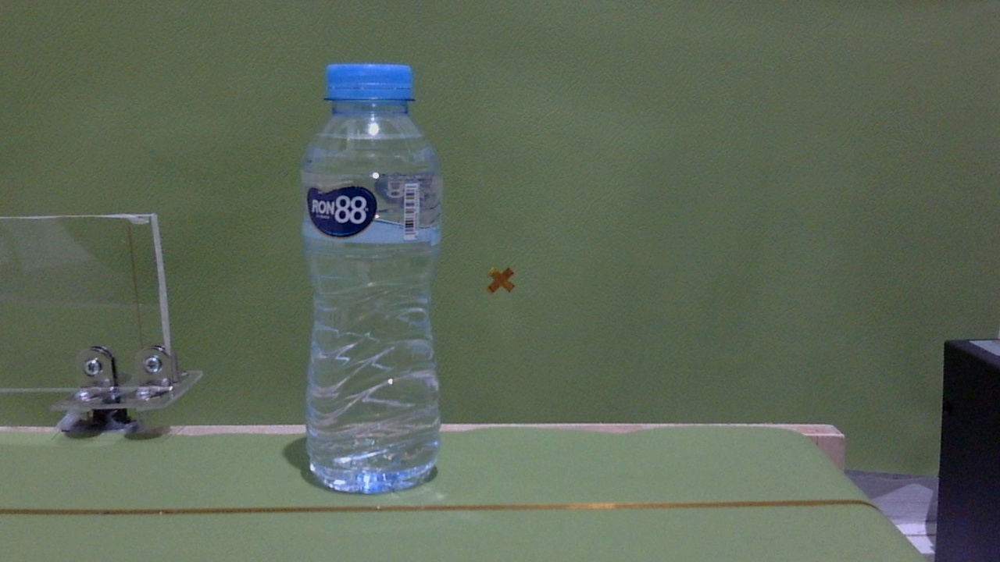
**Rysunek 2.1.** Przykład obrazu ze zbioru testowego.

Na obrazach występują zarówno produkty poprawne, jak i butelki zawierające różnego rodzaju wady jakościowe. W zbiorze uwzględniono następujące klasy:

- `good` – produkt poprawny,
- `wrong_bottle` – niewłaściwy typ butelki,
- `underfilled` – niedostateczny poziom napełnienia,
- `no_cap` – brak zakrętki,
- `loose_cap` – niepoprawnie zamocowana zakrętka,
- `debris` – obecność zanieczyszczeń,
- `damaged_label` – uszkodzona lub brakująca etykieta.

Zdjęcia zostały wykonane przy różnych ustawieniach butelki względem kamery, dzięki czemu zbiór zawiera naturalne różnice położenia obiektu, niewielkie zmiany oświetlenia oraz różne orientacje etykiety. Tak przygotowane dane pozwalają na ocenę odporności algorytmów na typowe zmiany występujące w rzeczywistych warunkach pracy systemu.

Łącznie zbiór danych zawiera **1500 obrazów**, które zostały podzielone na trzy niezależne podzbiory wykorzystywane podczas treningu i oceny modelu.


## 2.2. Struktura anotacji YOLO

Do oznaczenia obiektów wykorzystano format anotacji stosowany przez model YOLO (You Only Look Once). Każdemu obrazowi odpowiada plik tekstowy `.txt` zawierający informacje o wszystkich obiektach znajdujących się na zdjęciu.

Każdy wiersz pliku anotacji posiada następującą strukturę:

```text
class_id x_center y_center width height
```

gdzie:

- `class_id` – identyfikator klasy obiektu,
- `x_center` – współrzędna środka obiektu w osi X,
- `y_center` – współrzędna środka obiektu w osi Y,
- `width` – szerokość obiektu,
- `height` – wysokość obiektu.

Współrzędne zapisywane są jako wartości znormalizowane do przedziału od 0 do 1 względem rozmiaru obrazu. Dzięki temu możliwe jest trenowanie modelu na obrazach o różnych rozdzielczościach.

Przykładowa anotacja:

```text
0 0.502 0.487 0.182 0.642
```

oznacza obiekt klasy `0`, którego środek znajduje się w punkcie `(0.502, 0.487)` obrazu, a jego szerokość i wysokość wynoszą odpowiednio `18.2%` oraz `64.2%` wymiarów obrazu.

Informacje zapisane w anotacjach zostały wykorzystane nie tylko podczas trenowania modelu YOLO, ale również w części klasycznej projektu. Na ich podstawie wyznaczano położenie butelki, a następnie definiowano obszary zainteresowania (ROI) wykorzystywane podczas wykrywania wad.


## 2.3. Podział na zbiory treningowe, walidacyjne i testowe

Przed rozpoczęciem procesu uczenia dane zostały podzielone na trzy niezależne podzbiory:

- zbiór treningowy (`train`),
- zbiór walidacyjny (`val`),
- zbiór testowy (`test`).

Zbiór treningowy został wykorzystany do uczenia modelu. W trakcie kolejnych epok sieć neuronowa analizowała obrazy treningowe i aktualizowała swoje parametry w celu minimalizacji funkcji błędu.

Zbiór walidacyjny służył do bieżącej oceny jakości modelu podczas treningu. Po każdej epoce obliczane były metryki skuteczności na danych niewykorzystywanych bezpośrednio do uczenia. Pozwalało to monitorować zdolność modelu do generalizacji oraz ograniczać ryzyko przeuczenia.

Ostateczna ocena skuteczności została przeprowadzona na zbiorze testowym, który nie był wykorzystywany ani podczas treningu, ani podczas walidacji. Dzięki temu uzyskane wyniki stanowią obiektywną ocenę jakości działania systemu.

Podział danych przedstawiono w tabeli 2.1.

| Zbiór | Liczba obrazów |
|---------|---------:|
| Train | 960 |
| Validation | 240 |
| Test | 300 |
| **Razem** | **1500** |

**Tabela 2.1.** Podział zbioru danych na podzbiory treningowy, walidacyjny i testowy.


## 2.4. Rozkład klas w zbiorze danych

Najliczniejszą klasę stanowi klasa `good`, reprezentująca poprawne produkty. Jest to zgodne z rzeczywistymi warunkami przemysłowymi, gdzie liczba produktów spełniających wymagania jakościowe znacząco przewyższa liczbę produktów wadliwych.

Pozostałe klasy reprezentują różne rodzaje niezgodności jakościowych, takie jak brak zakrętki, niepełne napełnienie, obecność zanieczyszczeń czy uszkodzenie etykiety. Pomimo nierównomiernego rozkładu danych każda z klas posiada wystarczającą liczbę przykładów do przeprowadzenia procesu uczenia oraz późniejszej oceny skuteczności modelu.

Rozkład klas dla poszczególnych podzbiorów przedstawiono na rysunkach 2.2–2.4.

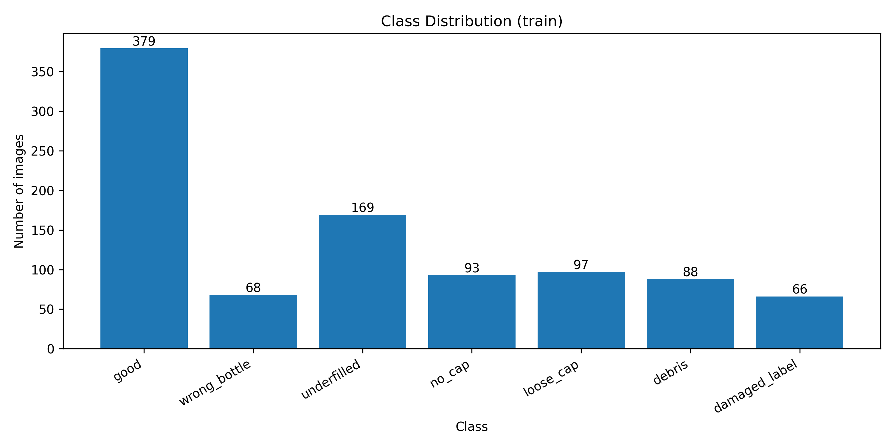

**Rysunek 2.2.** Rozkład klas w zbiorze treningowym.

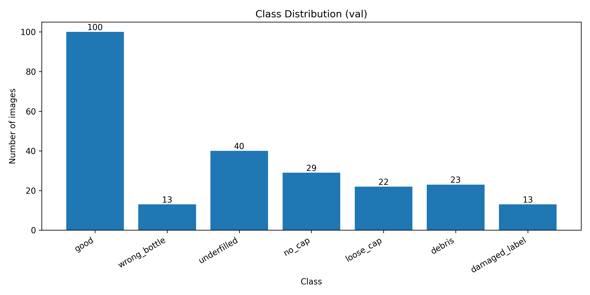

**Rysunek 2.3.** Rozkład klas w zbiorze walidacyjnym.

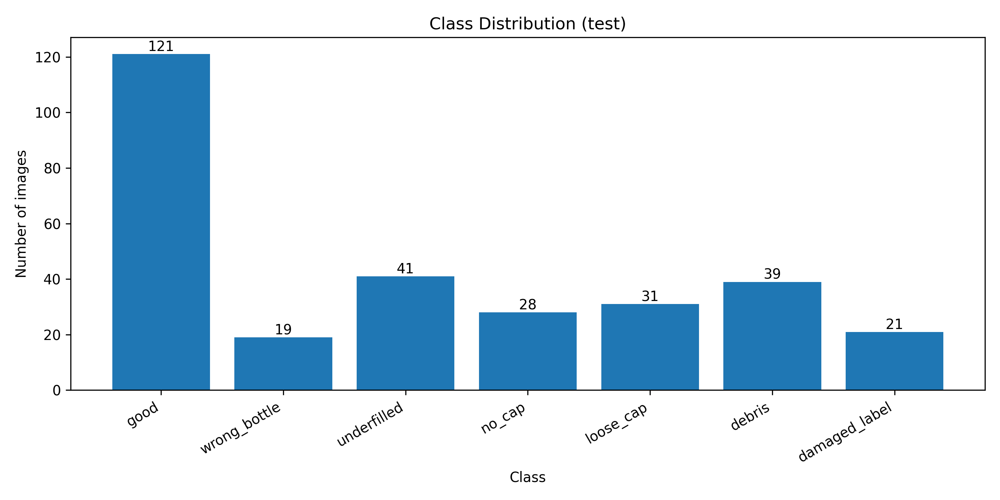

**Rysunek 2.4.** Rozkład klas w zbiorze testowym.

Analiza wykresów wskazuje, że proporcje klas pomiędzy zbiorami treningowym, walidacyjnym i testowym są zbliżone. Dzięki temu każdy z podzbiorów stanowi reprezentatywną próbkę całego zbioru danych, co pozwala na rzetelną ocenę jakości wytrenowanego modelu.


# 3. System oparty o model YOLO

## 3.1. Opis rozwiązania

Pierwszym z zaimplementowanych rozwiązań był system oparty o model detekcji obiektów YOLO (You Only Look Once). Celem systemu było automatyczne wykrywanie oraz klasyfikacja nieprawidłowości występujących na butelkach wody znajdujących się na przenośniku taśmowym.

W projekcie wykorzystano model YOLOv8, który umożliwia jednoczesne lokalizowanie obiektów na obrazie oraz przypisywanie ich do odpowiednich klas. W przeciwieństwie do klasyfikatorów obrazów model nie analizuje całego zdjęcia jako jednej próbki, lecz wyszukuje obiekty i zwraca dla każdego z nich:

* klasę obiektu,
* współczynnik pewności predykcji (confidence),
* współrzędne obwiedni (bounding box).

Model został wytrenowany do rozpoznawania siedmiu klas:

* good,
* wrong_bottle,
* underfilled,
* no_cap,
* loose_cap,
* debris,
* damaged_label.

Dane wejściowe zostały oznaczone przy użyciu anotacji w formacie YOLO. Każdemu obrazowi odpowiadał plik tekstowy zawierający współrzędne obwiedni oraz identyfikatory klas. W wielu przypadkach pojedynczy obraz zawierał więcej niż jedną anotację, np. obwiednię całej butelki oraz dodatkową obwiednię wskazującą wykrytą wadę.

Ogólny przepływ działania systemu przedstawia następujący schemat:

**Obrazy → Anotacje YOLO → Trening modelu → Walidacja → Zapis modelu best_pt → Predykcja → Ewaluacja wyników**


## 3.2. Proces treningu modelu

Proces uczenia realizowany był przy użyciu biblioteki Ultralytics YOLO. 

Podczas treningu model analizował obrazy ze zbioru treningowego oraz odpowiadające im anotacje. Po każdej epoce wykonywana była walidacja na zbiorze walidacyjnym, dzięki czemu możliwe było monitorowanie jakości modelu oraz wykrywanie ewentualnego przeuczenia.

W trakcie treningu zapisywane były podstawowe metryki jakości, takie jak:

* box loss,
* classification loss,
* distribution focal loss (DFL),
* precision,
* recall,
* mAP50,
* mAP50-95.

Na rysunku 3.1 przedstawiono przebieg procesu uczenia modelu.

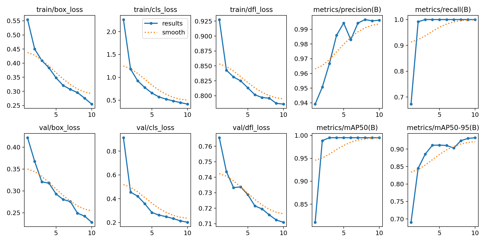
**Rysunek 3.1** Przebieg wartości funkcji strat oraz metryk jakości podczas treningu modelu YOLO.


Wraz ze wzrostem liczby epok obserwowany jest systematyczny spadek wszystkich funkcji strat zarówno dla zbioru treningowego, jak i walidacyjnego. Jednocześnie wartości Precision, Recall oraz mAP rosną i stabilizują się na bardzo wysokim poziomie.

Końcowe wartości metryk osiągnęły poziom:

* Precision ≈ 0.995,
* Recall ≈ 1.000,
* mAP50 ≈ 0.995,
* mAP50-95 ≈ 0.93.

Uzyskane wyniki wskazują na bardzo dobre dopasowanie modelu do analizowanego problemu oraz brak oznak przeuczenia.

Podczas treningu wygenerowana została również macierz pomyłek dla zbioru walidacyjnego.

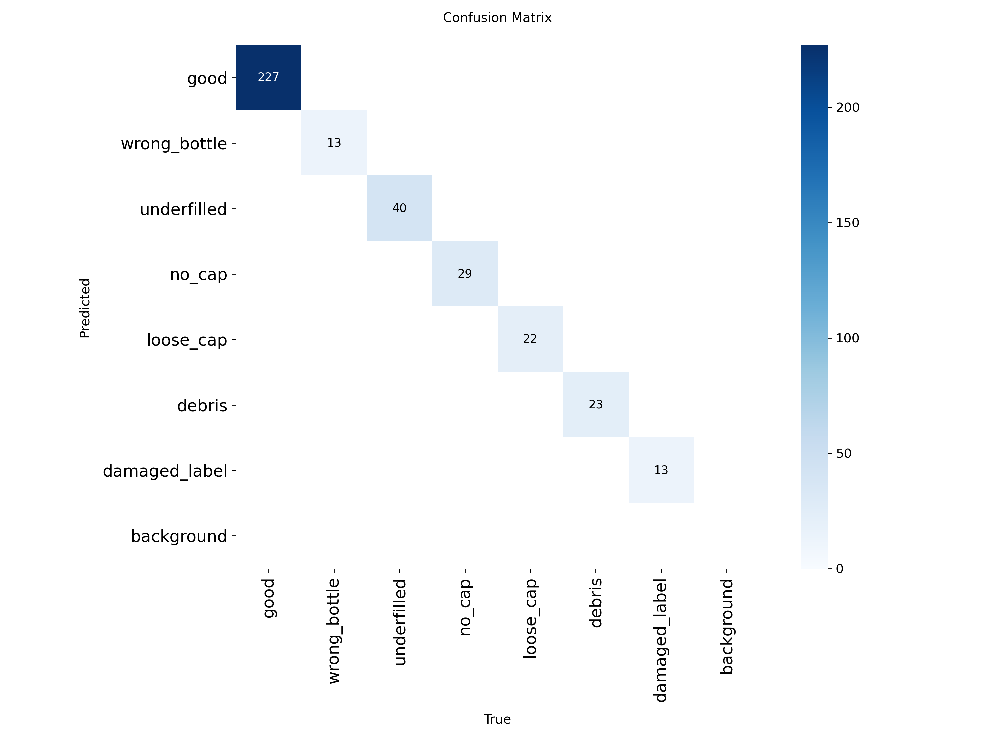
**Rysunek 3.2.** Macierz pomyłek wygenerowana podczas walidacji modelu.

Wyniki pokazują, że model w trakcie treningu bezbłędnie poradził sobie z danymi walidaycjnymi.

Wygenerowano również przykładowe obrazy prezentujące wyniki detekcji na danych walidacyjnych.

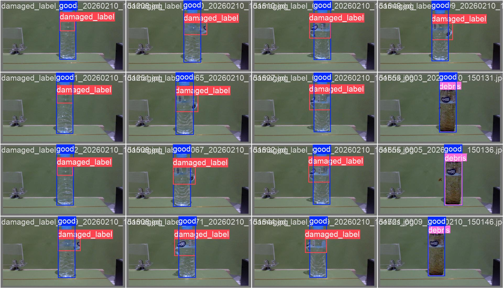
**Rysunek 3.3.** Przykładowe wyniki detekcji generowane automatycznie podczas treningu modelu.

Na podstawie wygenerowanych obrazów można zauważyć, że model poprawnie lokalizuje zarówno całe butelki, jak i obszary odpowiadające konkretnym nieprawidłowościom.

Uzyskane wyniki walidacyjne są bardzo wysokie i należy interpretować je z pewną ostrożnością. Wszystkie obrazy wykorzystane w projekcie zostały wykonane w bardzo podobnych warunkach – przy tym samym oświetleniu, z wykorzystaniem tej samej kamery oraz na tym samym stanowisku pomiarowym. Powoduje to, że zbiory treningowy i walidacyjny są do siebie bardzo podobne, co ułatwia modelowi osiąganie wysokiej skuteczności.

Dodatkowo część klas, takich jak `damaged_label` czy `wrong_bottle`, występuje stosunkowo rzadko w porównaniu z klasą `good`, co może wpływać na zawyżenie niektórych metryk jakości. Z tego względu wyniki walidacji nie powinny być traktowane jako ostateczny wyznacznik skuteczności modelu.

Bardziej miarodajną ocenę jakości rozwiązania stanowią wyniki uzyskane na niezależnym zbiorze testowym, który nie był wykorzystywany podczas procesu uczenia.


## 3.3. Proces predykcji

Po zakończeniu treningu zapisany został model `best.pt` zawierający najlepszy zestaw wag uzyskanych podczas procesu uczenia.

Proces predykcji realizowany był przez skrypt `yolo_predict.py`. Dla każdego obrazu testowego wykonywane były następujące operacje:

1. Wczytanie obrazu.
2. Wczytanie wytrenowanego modelu YOLO.
3. Wykonanie detekcji obiektów.
4. Wyznaczenie bounding boxów.
5. Przypisanie klas oraz wartości confidence.
6. Zapis wyników do plików tekstowych.
7. Zapis obrazów z naniesionymi obwiedniami.

Wyniki predykcji były następnie przekazywane do modułu ewaluacyjnego, który porównywał przewidywane klasy z rzeczywistymi etykietami zbioru testowego.

Na tej podstawie generowane były:

* macierz pomyłek,
* accuracy,
* precision,
* recall,
* F1-score.


## 3.4. Wyniki eksperymentów

Ostateczna ocena modelu została przeprowadzona na niezależnym zbiorze testowym.

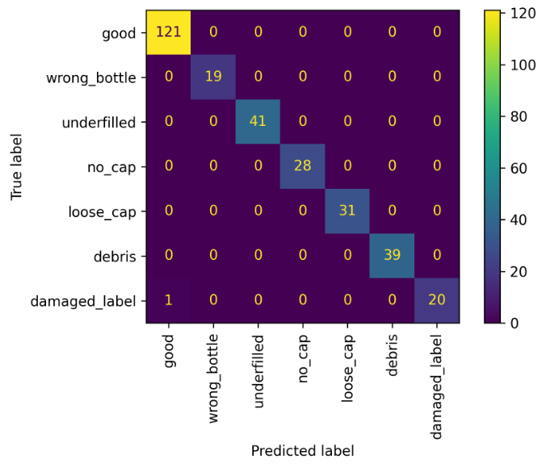
**Rysunek 3.4. Macierz pomyłek uzyskana dla zbioru testowego.**

Analiza macierzy pomyłek pokazuje bardzo wysoką skuteczność klasyfikacji dla wszystkich rozważanych klas.

Jedyny błąd klasyfikacji dotyczył pojedynczego przypadku klasy `damaged_label`, który został zaklasyfikowany jako `good`.

Oznacza to, że spośród 300 analizowanych obiektów jedynie jeden został sklasyfikowany niepoprawnie.

Uzyskane wyniki potwierdzają bardzo wysoką skuteczność modelu zarówno w zakresie lokalizacji obiektów, jak i ich klasyfikacji.

---
## 3.5. Analiza błędnych klasyfikacji

Analiza macierzy pomyłek wykazała występowanie tylko jednego błędnie sklasyfikowanego przypadku.

Błąd polegał na przypisaniu obiektu klasy `damaged_label` do klasy `good`. Oznacza to, że model nie rozpoznał uszkodzenia etykiety i potraktował produkt jako poprawny.

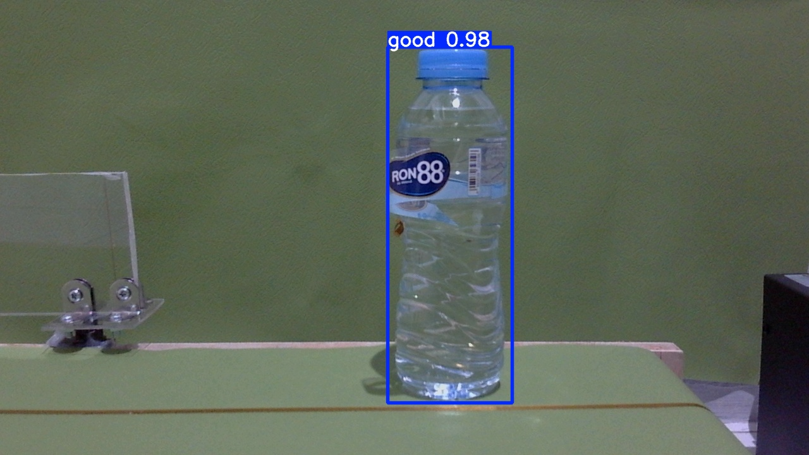

Przyczyną takiego zachowania mogły być:

* niewielki stopień uszkodzenia etykiety,
* częściowe zasłonięcie uszkodzonego obszaru,
* podobieństwo wizualne do poprawnych etykiet,
* ograniczona liczba przykładów klasy `damaged_label` w zbiorze treningowym.

Warto zauważyć, że klasa `damaged_label` była jedną z najmniej licznych klas w całym zbiorze danych. Mniejsza liczba przykładów treningowych mogła utrudnić modelowi nauczenie się wszystkich możliwych wariantów uszkodzeń.

Pomimo tego pojedynczego błędu model osiągnął bardzo wysoką skuteczność klasyfikacji.


## 3.6. Podsumowanie podejścia YOLO

Model YOLO okazał się bardzo skutecznym rozwiązaniem problemu automatycznej kontroli jakości butelek.

Najważniejsze zalety uzyskanego rozwiązania to:

* jednoczesna lokalizacja i klasyfikacja obiektów,
* bardzo wysoka skuteczność detekcji,
* niewielka liczba błędnych klasyfikacji,
* możliwość łatwego rozszerzania o nowe klasy wad,
* automatyczne generowanie metryk i raportów jakości.

Przeprowadzone eksperymenty wykazały, że model poprawnie rozpoznaje większość analizowanych nieprawidłowości oraz skutecznie lokalizuje ich położenie na obrazie. Uzyskane wyniki wskazują, że podejście oparte na sieciach neuronowych jest bardzo efektywne w zadaniach kontroli jakości i może stanowić podstawę do budowy rzeczywistych systemów inspekcji wizualnej. 

Wyniki  potwierdzają skuteczność modelu dla przygotowanego stanowiska badawczego, jednak nie gwarantują równie wysokiej skuteczności w bardziej zróżnicowanych warunkach. Zbiór treningowy był bardzo zbliżony do zbioru testowego pod kątem elementów takich jak: ustawienie aparatu, ustawienie butelki, oświetlenie.


# 4. System oparty o klasyczne metody przetwarzania obrazu

## 4.1. Opis rozwiązania

Drugie podejście zastosowane w projekcie oparto na klasycznych metodach przetwarzania obrazu. W przeciwieństwie do rozwiązania wykorzystującego sieć neuronową YOLO, detekcja poszczególnych wad realizowana była przy użyciu ręcznie zaprojektowanych algorytmów analizujących wybrane fragmenty obrazu.

System składa się z trzech niezależnych modułów odpowiedzialnych za wykrywanie:

- braku zakrętki (no_cap),
- zanieczyszczeń wewnątrz butelki (debris),
- uszkodzonej lub brakującej etykiety (damaged_label).

Dla każdego obrazu wyznaczano obszary zainteresowania (ROI – Region of Interest), w których wykonywana była dalsza analiza.

W celu oceny skuteczności działania każdego modułu przygotowano osobne procedury testowe generujące:

- plik CSV z wynikami klasyfikacji,
- macierz pomyłek,
- podstawowe metryki jakości klasyfikacji (Accuracy, Precision, Recall oraz F1-score),
- zestaw błędnie sklasyfikowanych próbek.

Takie podejście umożliwiło niezależną ocenę skuteczności każdego algorytmu oraz porównanie ich z rozwiązaniem opartym o model YOLO.


## 4.2. Detekcja braku zakrętki

Detekcja braku zakrętki realizowana była poprzez analizę górnej części butelki.

Po odczytaniu położenia butelki z anotacji wyznaczany był obszar ROI obejmujący fragment odpowiadający miejscu występowania zakrętki. Następnie obraz ROI konwertowany był do przestrzeni barw HSV, co umożliwiało łatwiejszą separację koloru zakrętki od tła.

W projekcie wykorzystano zakres kolorów odpowiadający niebieskim zakrętkom występującym w zbiorze danych. Na podstawie progowania tworzona była maska binarna, a następnie wyszukiwane były kontury odpowiadające wykrytym obiektom.

Dla największego znalezionego konturu wyznaczano:

- wysokość względem ROI,
- szerokość względem ROI,
- pole powierzchni.

Jeżeli wysokość wykrytego obiektu przekraczała ustalony próg, uznawano że zakrętka jest obecna. W przeciwnym przypadku obraz klasyfikowany był jako no_cap.

Zaletą takiego podejścia jest bardzo niewielki koszt obliczeniowy oraz łatwa interpretacja wyników. Ograniczeniem pozostaje jednak duża zależność od koloru zakrętki oraz warunków oświetleniowych.

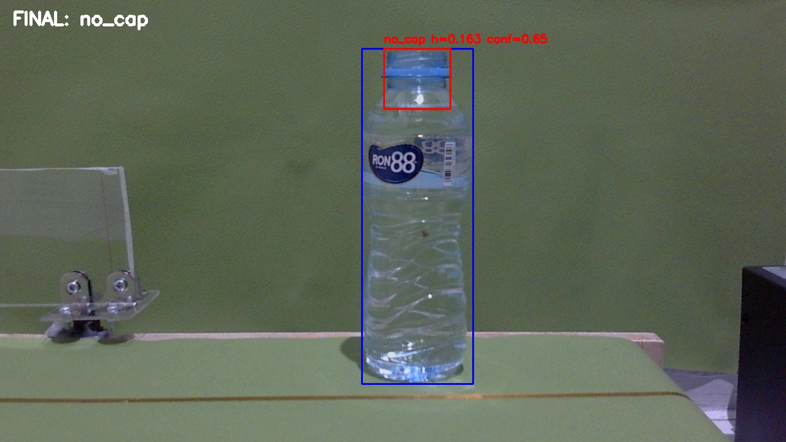
**Rysunek 4.1.** Prawidłowa klasyfikacja braku zakrętki


## 4.3. Detekcja zanieczyszczeń

Wykrywanie zanieczyszczeń realizowane było poprzez analizę środkowej części butelki, w której znajduje się ciecz.

Dla określonego obszaru ROI wykonywana była konwersja obrazu do przestrzeni HSV. Następnie obliczano kilka cech opisujących zawartość analizowanego fragmentu:

- udział pikseli ciemnych,
- udział pikseli brązowych,
- średnie nasycenie kolorów,
- średnią jasność obrazu.

Założono, że obecność zanieczyszczeń powoduje zwiększenie liczby ciemnych lub brązowych pikseli oraz zmianę rozkładu kolorów w obrębie butelki.

Klasyfikacja była realizowana za pomocą zestawu progów decyzyjnych. Jeżeli którykolwiek z analizowanych parametrów przekraczał ustalony próg, obraz oznaczany był jako debris. W przeciwnym przypadku przypisywana była klasa good.

Metoda ta dobrze sprawdza się dla zanieczyszczeń o wyraźnym kolorze i dużej powierzchni, jednak może mieć trudności z wykrywaniem bardzo drobnych zabrudzeń lub zmian o niewielkim kontraście względem tła.

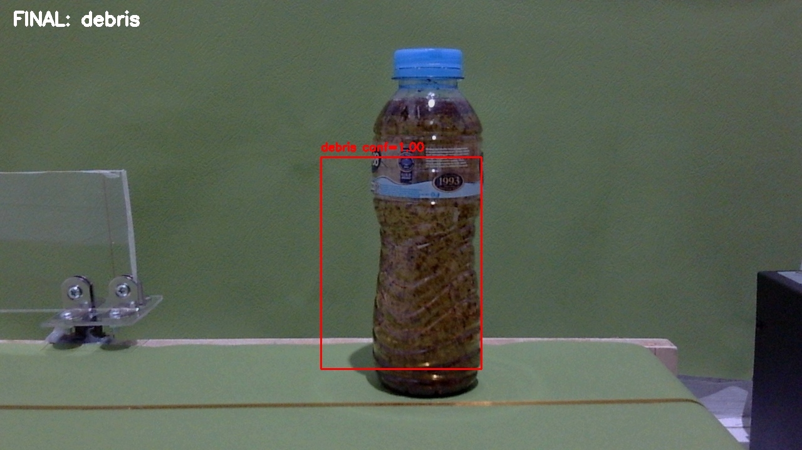
**Rysunek 4.2.** Prawidłowa klasyfikacja zanieczyszczenia cieczy


## 4.4. Detekcja braku etykiety

Pierwotnym celem modułu było wykrywanie uszkodzonych etykiet. W trakcie eksperymentów okazało się jednak, że stopień uszkodzenia etykiety jest trudny do jednoznacznego opisania za pomocą prostych cech obrazu.

W związku z tym ostatecznie zastosowano uproszczone podejście polegające na wykrywaniu obecności charakterystycznego niebieskiego fragmentu etykiety.

Po wyznaczeniu ROI odpowiadającego położeniu etykiety obraz konwertowany był do przestrzeni HSV. Następnie wykonywano progowanie koloru niebieskiego, tworząc maskę binarną.

Dla utworzonej maski wyznaczano:

- całkowity udział niebieskich pikseli,
- największy spójny obszar koloru niebieskiego.

Za obecność etykiety uznawano sytuację, w której największy wykryty obszar przekraczał ustalony próg powierzchni. W przeciwnym przypadku obraz klasyfikowany był jako damaged_label.

Należy podkreślić, że w praktyce algorytm wykrywał głównie brak etykiety, a nie jej rzeczywiste uszkodzenia. Oznacza to, że częściowo uszkodzona etykieta zawierająca nadal widoczne fragmenty charakterystycznego koloru była zazwyczaj klasyfikowana jako poprawna.

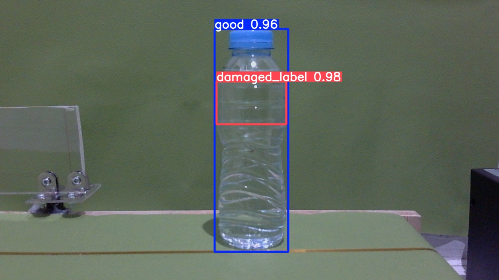
**Rysunek 4.3.** Prawidłowa klasyfikacja braku etykiety


## 4.5. Wyniki eksperymentów

Skuteczność każdego modułu oceniono na zbiorze testowym wykorzystanym również podczas ewaluacji modelu YOLO.

### Detekcja braku zakrętki

Wyniki przedstawiono na rysunku zawierającym macierz pomyłek dla klas:

- **good** - obecność zakrętki,
- **no_cap** - brak zakrętki.

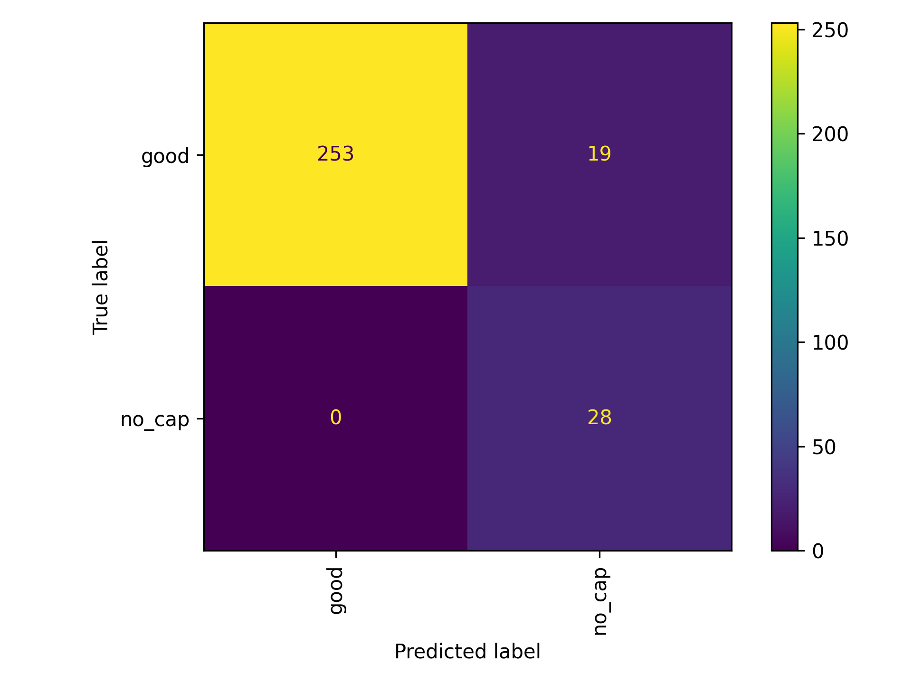
**Rysunek 4.4.** Macierz pomyłek dla detekcji braku zakrętki.

Moduł poprawnie wykrył wszystkie próbki klasy no_cap, nie generując fałszywych negatywów. Jednocześnie część poprawnych butelek została błędnie sklasyfikowana jako brak zakrętki.

Uzyskane wyniki wskazują na wysoką skuteczność wykrywania rzeczywistego braku zakrętki.

### Detekcja zanieczyszczeń

Wyniki przedstawiono na rysunku zawierającym macierz pomyłek dla klas:

- **good** - płyn niezanieczyszczony,
- **debris** - płyn zanieczyszczony.

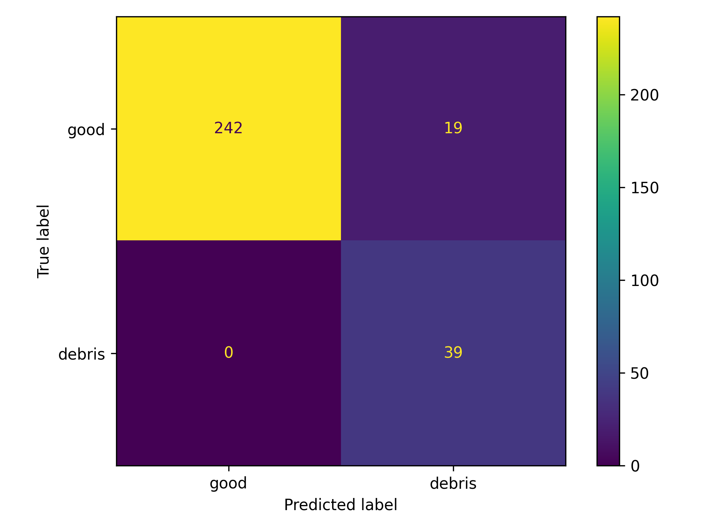
**Rysunek 4.2.** Macierz pomyłek dla detekcji zanieczyszczeń.

Algorytm wykazał wysoką skuteczność dla próbek zawierających wyraźne zabrudzenia oraz zmętnienie cieczy.

Najlepsze rezultaty uzyskiwano dla przypadków, w których zanieczyszczenia zajmowały znaczną część objętości butelki lub posiadały wyraźny kolor odróżniający się od przezroczystej wody.

### Detekcja etykiety

Wyniki przedstawiono na rysunku zawierającym macierz pomyłek dla klas:

- **good** - obecność etykiety,
- **damaged_label** - brak etykiety.

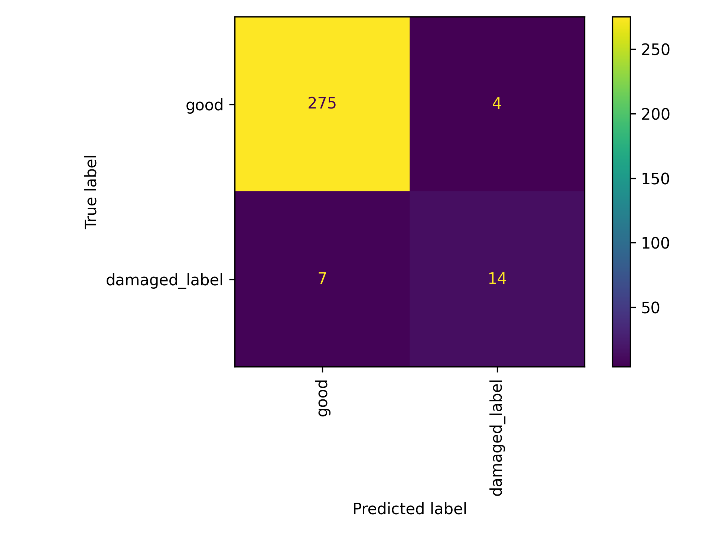
**Rysunek 4.5.** Macierz pomyłek dla detekcji etykiety.

W przypadku detekcji etykiety uzyskano poprawne rozpoznawanie większości próbek klasy good.

Jednocześnie część uszkodzonych etykiet została sklasyfikowana jako poprawna, ponieważ zachowane zostały fragmenty niebieskiego elementu graficznego wykorzystywanego przez algorytm jako cecha identyfikacyjna.


## 4.6. Analiza błędnych klasyfikacji

Analiza błędnie sklasyfikowanych próbek pozwoliła wskazać główne ograniczenia zastosowanych metod.

W przypadku **detekcji braku zakrętki** większość błędnych klasyfikacji nie wynikała z ograniczeń samego algorytmu, lecz z różnic pomiędzy butelkami występującymi w zbiorze danych. Zastosowana metoda opierała się na analizie koloru oraz cech charakterystycznych zakrętki w wyznaczonym obszarze ROI. Parametry detektora zostały dobrane na podstawie butelki wykorzystywanej podczas projektowania systemu. W przypadku innych typów butelek, posiadających zakrętki o odmiennym kolorze, kształcie lub materiale, algorytm nie zawsze był w stanie poprawnie rozpoznać ich obecność. Przykład takiej sytuacji przedstawiono na rysunku 4.6, gdzie butelka posiada zakrętkę, jednak ze względu na odmienny wygląd została błędnie sklasyfikowana jako przypadek braku zakrętki.
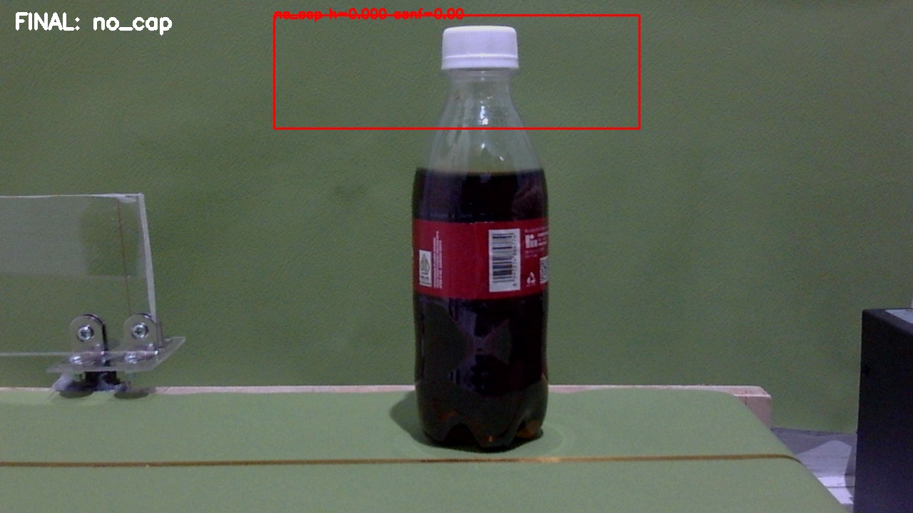
**Rysunek 4.6.** Błędnie przypisany brak zakrętki

W przypadku **detekcji zanieczyszczeń** błędne klasyfikacje były związane z obecnością butelek o innym wyglądzie niż obiekty wykorzystane podczas projektowania i strojenia algorytmu. Metoda opierała się na analizie koloru oraz charakterystyki zawartości wewnątrz butelki, a wartości progowe zostały dobrane dla konkretnego typu przezroczystej butelki z wodą. W przypadku innych butelek algorytm interpretował znaczną część obszaru butelki jako zanieczyszczenie. Prowadziło to do błędnej klasyfikacji obiektów jako „debris”, mimo że nie zawierały one rzeczywistych zanieczyszczeń. Przykład takiej sytuacji przedstawiono na rysunku 4.7, gdzie butelka z ciemnym napojem została zakwalifikowana jako przypadek występowania zanieczyszczeń.
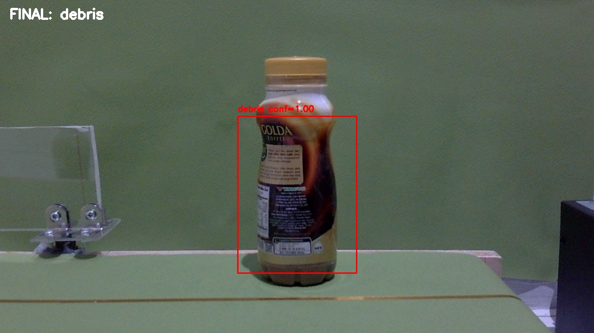
**Rysunek 4.7.** Błędnie przypisane zanieczyszczenie płynu

Najwięcej trudności sprawiała **detekcja etykiety**. Część etykiet oznaczonych w zbiorze danych jako damaged_label zawierała nadal znaczną część charakterystycznych elementów graficznych. W takich sytuacjach algorytm poprawnie wykrywał niebieskie fragmenty etykiety i klasyfikował obraz jako good. Ten błąd widać na Rysunku 4.8.
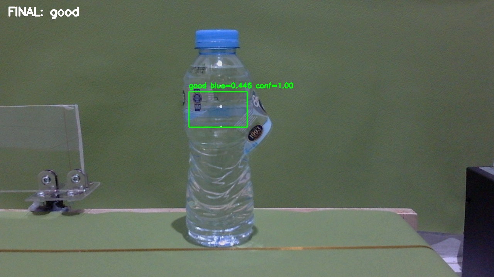**Rysunek 4.8.** Błędnie sklasyfikowana butelka (etykieta) jako poprawna

Na rysunku 4.9 przedstawiono przykład błędnej klasyfikacji etykiety jako uszkodzonej. Algorytm został skonfigurowany na podstawie etykiet występujących w zbiorze treningowym, które zawierały charakterystyczne niebieskie elementy graficzne. W analizowanym przypadku etykieta posiada zupełnie inną kolorystykę i wzór, przez co nie spełnia założonych kryteriów detekcji. W rezultacie system błędnie zaklasyfikował etykietę jako uszkodzoną, mimo że była ona w pełni obecna i czytelna.
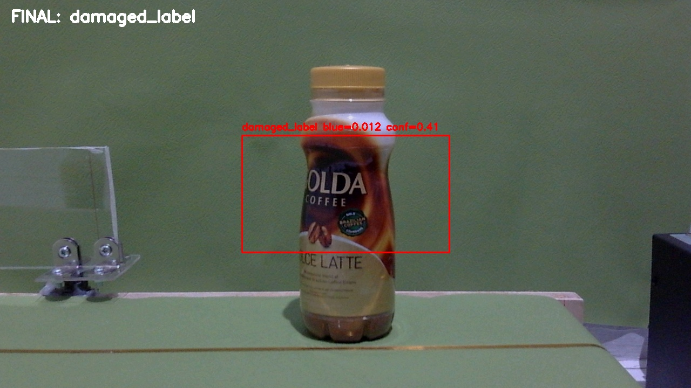
**Rysunek 4.9.** Błędnie sklasyfikowana butelka (etykieta) jako uszkodzona

Pokazuje to ograniczenie klasycznych metod opartych na progowaniu kolorów – brak możliwości zrozumienia semantycznej zawartości obrazu i oceny rzeczywistego stopnia uszkodzenia etykiety.


## 4.7. Podsumowanie podejścia klasycznego

Zastosowane klasyczne metody przetwarzania obrazu pozwoliły na skuteczne wykrywanie wybranych wad butelek przy bardzo niewielkich wymaganiach obliczeniowych.

Najlepsze rezultaty uzyskano dla detekcji braku zakrętki oraz wykrywania zanieczyszczeń, gdzie wykorzystane cechy obrazu dobrze odpowiadały analizowanym problemom.

Największe trudności pojawiły się podczas analizy etykiet. Wykrywanie rzeczywistych uszkodzeń etykiety okazało się znacznie bardziej złożone niż identyfikacja jej całkowitego braku. Z tego względu końcowa wersja algorytmu została uproszczona do wykrywania obecności charakterystycznych fragmentów etykiety.

W porównaniu z modelem YOLO podejście klasyczne oferuje większą interpretowalność działania oraz niższe wymagania sprzętowe, jednak jest znacznie mniej uniwersalne i wymaga ręcznego dostrajania parametrów dla każdego rodzaju wykrywanej wady.


# 5. Porównanie podejść

## 5.1. Porównanie skuteczności

W ramach projektu zaimplementowano dwa niezależne podejścia do kontroli jakości butelek: rozwiązanie wykorzystujące model YOLO oraz zestaw klasycznych algorytmów przetwarzania obrazu.

Model YOLO umożliwiał jednoczesną detekcję oraz klasyfikację wszystkich analizowanych klas:

- good,
- wrong_bottle,
- underfilled,
- no_cap,
- loose_cap,
- debris,
- damaged_label.

Na zbiorze testowym model osiągnął bardzo wysoką skuteczność. Macierz pomyłek wykazała jedynie pojedynczy przypadek błędnej klasyfikacji, gdzie próbka klasy `damaged_label` została rozpoznana jako `good`.

Podejście klasyczne było testowane oddzielnie dla każdej wykrywanej wady. Najlepsze wyniki uzyskano dla detekcji braku zakrętki oraz zanieczyszczeń. Największe trudności pojawiły się podczas wykrywania uszkodzonej etykiety, gdzie skuteczność była ograniczona przez konieczność wykorzystania prostych cech obrazu.

Tabela 5.1 przedstawia jakościowe porównanie skuteczności obu rozwiązań.

| Kryterium | YOLO | Metody klasyczne |
|------------|------|------------------|
| Detekcja wielu klas jednocześnie | Tak | Nie |
| Detekcja uszkodzonej etykiety | Bardzo dobra | Ograniczona |
| Detekcja braku zakrętki | Bardzo dobra | Bardzo dobra |
| Detekcja zanieczyszczeń | Bardzo dobra | Dobra |
| Odporność na zmiany obrazu | Wysoka | Niska |
| Możliwość skalowania | Wysoka | Ograniczona |

Można zauważyć, że model YOLO zapewnia wyższą skuteczność oraz większą uniwersalność w przypadku bardziej złożonych problemów klasyfikacyjnych.


## 5.2. Porównanie złożoności implementacji

Implementacja klasycznych metod przetwarzania obrazu była stosunkowo prosta i opierała się głównie na:

- progowaniu kolorów,
- analizie histogramów,
- analizie konturów,
- obliczaniu podstawowych statystyk obrazu.

Takie rozwiązanie nie wymaga procesu uczenia ani przygotowywania dużego zbioru treningowego. Jednocześnie konieczne było ręczne dobieranie progów decyzyjnych dla każdego modułu co w warunkach produkcyjnych może nie być wystarczająco efektywne.

W przypadku modelu YOLO proces implementacji był bardziej złożony. Wymagał:

- przygotowania anotacji,
- podziału danych na zbiory train, val i test,
- konfiguracji procesu treningu,
- doboru parametrów uczenia,
- przeprowadzenia treningu modelu.

Po zakończeniu procesu uczenia model samodzielnie nauczył się rozpoznawania wszystkich klas bez konieczności ręcznego definiowania reguł.


## 5.3. Zalety i wady obu podejść

### Model YOLO

**Zalety:**

- bardzo wysoka skuteczność klasyfikacji,
- możliwość jednoczesnej detekcji i klasyfikacji wielu klas,
- wysoka odporność na zmiany położenia obiektu,
- łatwe rozszerzanie o kolejne klasy,
- brak konieczności ręcznego definiowania cech obrazu.

**Wady:**

- konieczność przygotowania oznaczonych danych treningowych,
- dłuższy czas przygotowania rozwiązania,
- większe wymagania sprzętowe,
- mniejsza interpretowalność działania modelu.

### Metody klasyczne

**Zalety:**

- prostota implementacji,
- niewielkie wymagania obliczeniowe,
- szybkie działanie,
- łatwa interpretacja wyników.

**Wady:**

- konieczność ręcznego dostrajania parametrów,
- duża zależność od warunków oświetleniowych,
- ograniczona możliwość wykrywania złożonych uszkodzeń,
- konieczność projektowania osobnego algorytmu dla każdej wady.


# 6. Wnioski końcowe

Założony cel projektu został zrealizowany. Opracowany system umożliwia automatyczną analizę obrazów butelek oraz wykrywanie wybranych wad jakościowych bez konieczności ręcznej oceny przez operatora.

Uzyskane wyniki potwierdziły, że zastosowanie modelu YOLO stanowi skuteczne rozwiązanie dla problemu kontroli jakości. Model osiągnął bardzo wysoką skuteczność klasyfikacji oraz wykazał zdolność poprawnego rozpoznawania wszystkich analizowanych klas na danych testowych. Jednocześnie klasyczne metody przetwarzania obrazu potwierdziły swoją przydatność w przypadku prostszych zadań detekcyjnych, oferując niewielkie wymagania obliczeniowe oraz łatwość interpretacji działania.

W trakcie realizacji projektu zidentyfikowano również ograniczenia obu podejść. W przypadku metod klasycznych największym problemem okazała się konieczność ręcznego definiowania cech i progów decyzyjnych. Z kolei skuteczność modelu YOLO jest silnie uzależniona od jakości oraz różnorodności danych treningowych.

W przyszłości projekt mógłby zostać rozszerzony o większy i bardziej zróżnicowany zbiór danych, analizę obrazów pochodzących z różnych stanowisk pomiarowych oraz integrację systemu z rzeczywistą linią produkcyjną. Możliwe byłoby również zastosowanie bardziej zaawansowanych modeli głębokiego uczenia lub połączenie metod klasycznych z modelami uczenia maszynowego w celu dalszego zwiększenia skuteczności detekcji.

Podsumowując, przeprowadzone prace pozwoliły stworzyć działający system kontroli jakości oraz wykazały przewagę podejścia opartego na modelu YOLO w analizowanym zastosowaniu.
